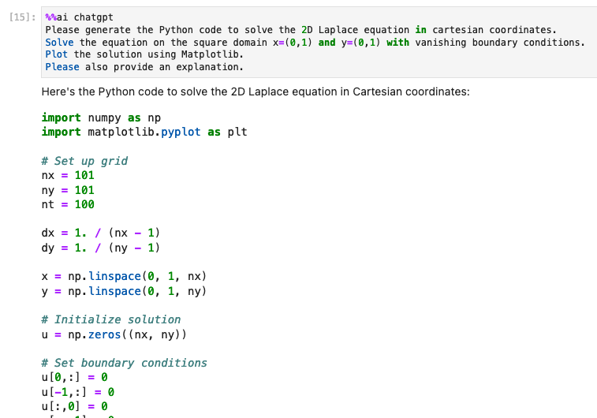

# jupyter-ai

A generative AI extension for Jupyter, to allow for AI to interact with notebooks and other documents. Documentation is available on [ReadTheDocs](https://jupyter-ai.readthedocs.io/en/latest/).

From within a Jupyter notebook, Jupyter AI adds a `%%ai` magic command that can generate code:

Jupyter AI can also generate HTML and math to be rendered as cell output.

Jupyter AI can interpolate IPython expressions, allowing you to run prompts
that include variable values.

This is a monorepo that houses the core `jupyter_ai` package in addition to the
default supported AI modules. To learn more about the core package, please refer
to the [core package's README](packages/jupyter-ai/README.md).

### Using

For help with installing and using Jupyter AI, please see our
[user documentation on ReadTheDocs](https://jupyter-ai.readthedocs.io/en/latest/users/index.html).

### Contributing

If you would like to contribute to Jupyter AI, see our
[contributor documentation on ReadTheDocs](https://jupyter-ai.readthedocs.io/en/latest/contributors/index.html).
